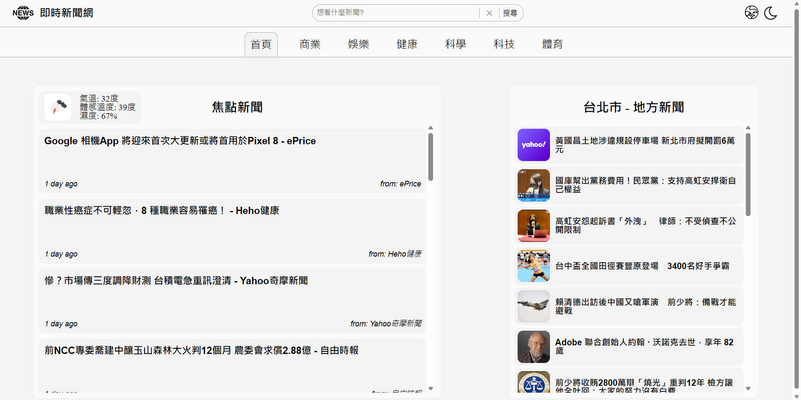

### Description

This project is a news website designed to offer users real-time access to the latest news. Users have the capability to browse news articles by category, as well as perform customized searches using keywords.

### Get started

#### Prerequisites

Ensure you have node.js and npm installed

#### Installation

Clone the project using the command below:

git clone https://github.com/Kaijun-Huang/news-app.git

Direct to the location of this file and enter the command:

npm install

After installing, use npm start to start the project.

In case the web app doesn’t come out automatically, please navigate to http://localhost:3000 manually.
To terminate the web app, use ctrl + c to terminate

#### Built with

React.js
scss/sass
axios
